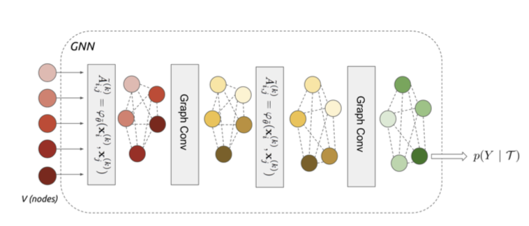
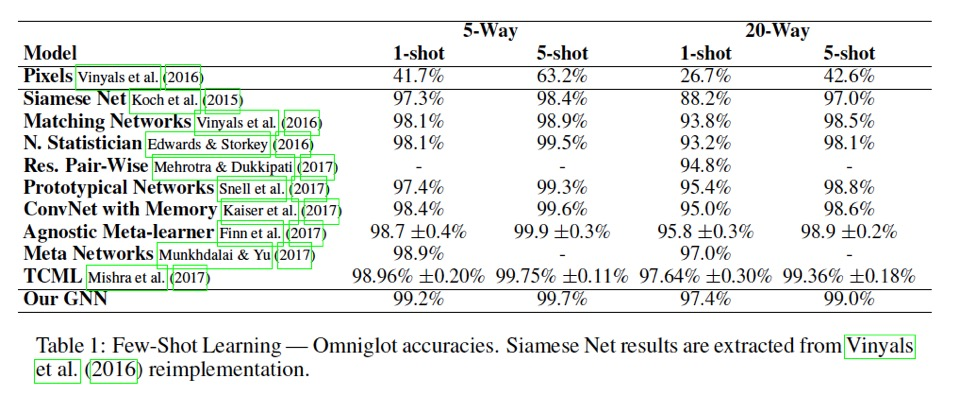
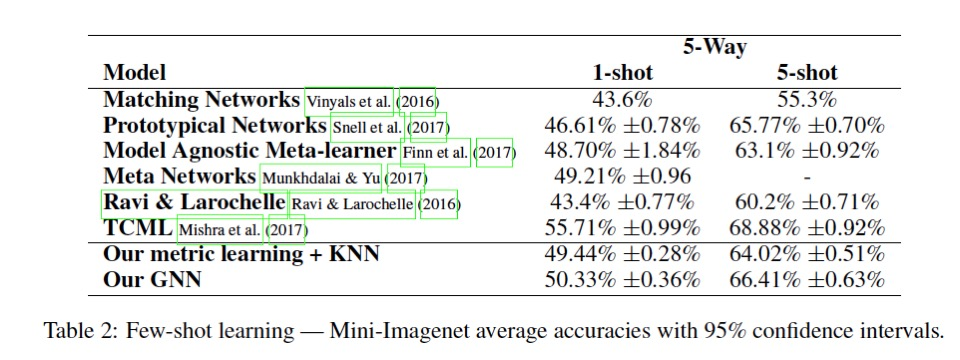

<script type="text/javascript" async
src="https://cdnjs.cloudflare.com/ajax/libs/mathjax/2.7.2/MathJax.js? 
config=TeX-MML-AM_CHTML"
</script>

# Few-shot Learning with Graph Neural Networks

#### Related papers:
- [SEMI-SUPERVISED CLASSIFICATION WITH GRAPH CONVOLUTIONAL NETWORKS](https://arxiv.org/pdf/1609.02907.pdf)
- [Few-shot Learning with Graph Neural Networks](https://arxiv.org/pdf/1711.04043.pdf)

#### Related articles: 
- [GRAPH CONVOLUTIONAL NETWORKS](https://tkipf.github.io/graph-convolutional-networks/)
    - [Convolution Network及其变种（反卷积、扩展卷积、因果卷积、图卷积）](https://www.cnblogs.com/yangperasd/p/7071657.html)```其中图卷积解释来自上面英文版文章```
- [图卷积网络（Graph Convolutional Network）](https://blog.csdn.net/chensi1995/article/details/77232019)
- [浅析图卷积神经网络](https://www.jianshu.com/p/89fbed65cd04?winzoom=1)

## Graph Neural Networks


> This part is summarized from the article: https://tkipf.github.io/graph-convolutional-networks/


### Definition

For graph neural networks models, the goal is to learn a function of signals/features on a graph ***G = (V, E)*** which takes as input:
- A feature description ***xi*** for every node ***i***; summarized in a ***N×D*** feature matrix ***X*** (***N***: number of nodes, ***D***: number of input features);
- A representative description of the graph structure in matrix form; typically in the form of an adjacency matrix ***A*** (or some function thereof);
- A node-level output ***Z*** (an ***N×F*** feature matrix, where ***F*** is the number of output features per node).

Every neural network layer can then be written as a non-linear function: $$ H^{(l+1)} = f(H^{(l)}, A) $$, where $ H^{(0)} = X $ and $ H^{(L)} = Z $


### Example

As an example, let‘s consider the following very simple form of a layer-wise propagation rule: $ f(H^{(l)}, A) =  σ(AH^{(l)}W^{(l)}) $, where **$W^{(l)}$** is a weight matrix for the **l-th** neural network layer and **$σ(⋅)$** is a non-linear activation function like the **ReLU**. 

However, this simple model has 2 limitations:
- multiplication with **A** means that, for every node, we sum up all the feature vectors of all neighboring nodes but not the node itself (unless there are self-loops in the graph).
- **A** is typically not normalized and therefore the multiplication with **A** will completely change the scale of the feature vectors (we can understand that by looking at the eigenvalues of **A**).

### Solutions

To solve the limitations, we essentially get the propagation rule introduced in [Kipf & Welling (ICLR 2017)](https://arxiv.org/pdf/1609.02907.pdf):
$$ f(H^{(l)}, A) =  σ(\hat{D}^{\frac{-1}{2}} \hat{A} \hat{d}^{\frac{-1}{2}}H^{(l)}W^{(l)}) $$
- here use $ \hat{A} = A + I $, which is the adjacency matrix of the undirected graph **G** with added self-connections. 
- to normalizing **A**, we use a symmetric normalization, i.e. $$D^{\frac{-1}{2}} A D^{\frac{-1}{2}}$$                (where **D** is the diagonal node degree matrix of **A**)

## Model 


> This part is summarized from the paper: Few-shot Learning With Graph Neural Networks


In this model, the input **T** contains a collection of images, both labeled and unlabeled, and they associate **T** with a fully-connected graph **$G = (V,E)$** where nodes **v** correspond to the images present in **T** (both labeled and unlabeled).


For images xi with known label **$l_i$** , the one-hot encoding of the label is concatenated with the embedding features of the image at the input of the GNN.

- where 𝟇 is a convolutional neural network
- **$h(l)$** is a one-hot encoding of the label

Inspired by message-passing algorithms(Kearnes et al.(2016); Gilmer et al. (2017)), they generalized the GNN to learn edge features **A(k)**  from the current node hidden representation:

- where 𝞿 is a symmetric function parametrized with a neural network. 
- In this work, they consider a Multilayer Perceptron stacked after the absolute difference between two vector nodes.


### Details


### Experiments
#### Experiments on Omniglot

> Architectures: Inspired by the embedding architecture from Vinyals et al. (2016), following Mishra et al. (2017), a CNN was used as an embedding  function consisting of four stacked blocks of f33-convolutional layer with 64 filters, batch-normalization, 22 max-pooling, leaky-relug the output is passed through a fully connected layer resulting in a 64-dimensional embedding. For the
GNN we used 3 blocks each of them composed by 1) a module that computes the adjacency matrix and 2) a graph convolutional layer.





#### Experiments on Mini-ImageNet

> Architecture: The embedding architecture used for Mini-Imagenet is formed by 4 convolutional layers followed by a fully-connected layer resulting in a 128 dimensional embedding. This light architecture is useful for fast prototyping:
1x{3x3-conv. layer (64 filters), batch normalization, max pool(2, 2), leaky relu},
1x{3x3-conv. layer (96 filters), batch normalization, max pool(2, 2), leaky relu},
1x{3x3-conv. layer (128 filters), batch normalization, max pool(2, 2), leaky relu, dropout(0:5)},
1x{33-conv. layer (256 filters), batch normalization, max pool(2, 2), leaky relu, dropout(0:5)},
1x{fc-layer (128 filters), batch normalization}.
The two dropout layers are useful to avoid overfitting the GNN in Mini-Imagenet dataset. The GNN architecture is similar than for Omniglot, it is formed by 3 blocks.


